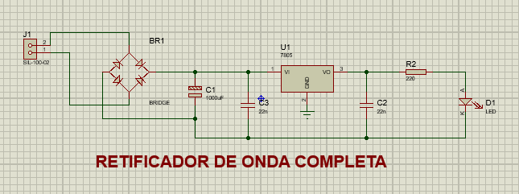
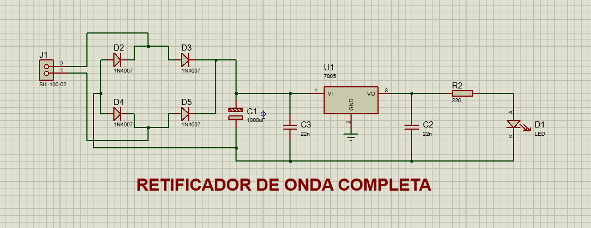
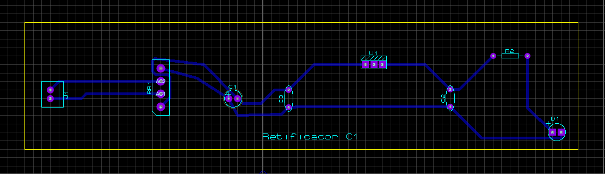
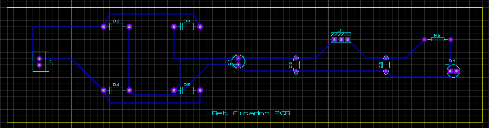
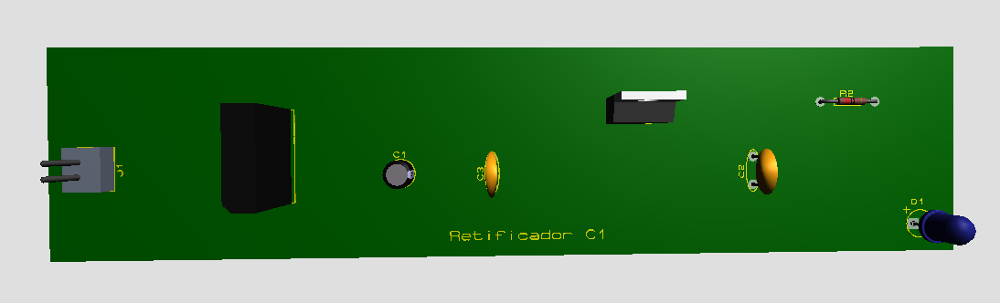
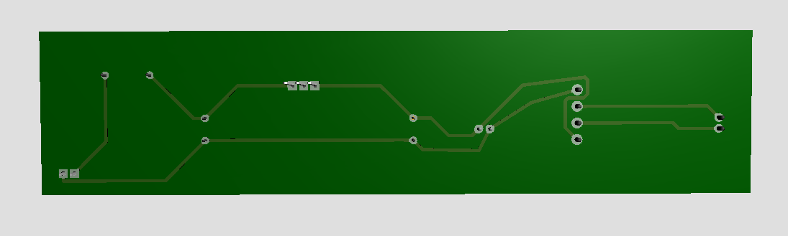
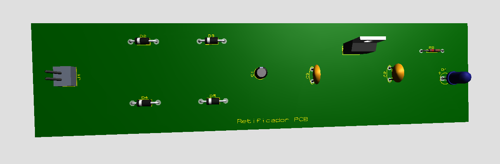
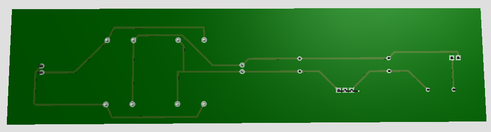

Repositório da disciplina de Sistemas Embarcados 2023

Professor: Rafael Rodrigues Barbosa

------------------------------------------------------

Nesse projeto, foi elaborado um circuito em um programa de simulação, um retificador de onda de corrente elétrica. 

Veja a seguir, imagens do circuito.

------------------------------------------------------

<h1>Schematic Capture<h1>

Esquematico do circuito de retificador de onda com ponte de diodo

------------------------------------------------------

<h1>Schematic Capture<h1>

Esquematico do circuito de retificador de onda com diodo manual

------------------------------------------------------

<h1>Pcb Layout<h1>

Pcb layout do circuito de retificador de onda com ponte de diodo

------------------------------------------------------

<h1>Pcb Layout<h1>

Pcb layout do circuito de retificador de onda com diodo manual

------------------------------------------------------

<h1>3d Visual<h1>

3d Visual do circuito de retificador de onda com ponte de diodo, parte superior

------------------------------------------------------

<h1>3d Visual<h1>

3d Visual do circuito de retificador de onda com ponte de diodo, parte inferior

------------------------------------------------------

<h1>3d Visual<h1>

3d Visual do circuito de retificador de onda com diodo manual, parte superior

------------------------------------------------------

<h1>3d Visual<h1>

3d Visual do circuito de retificador de onda com diodo manual, parte inferior

------------------------------------------------------