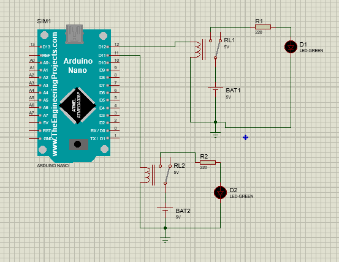
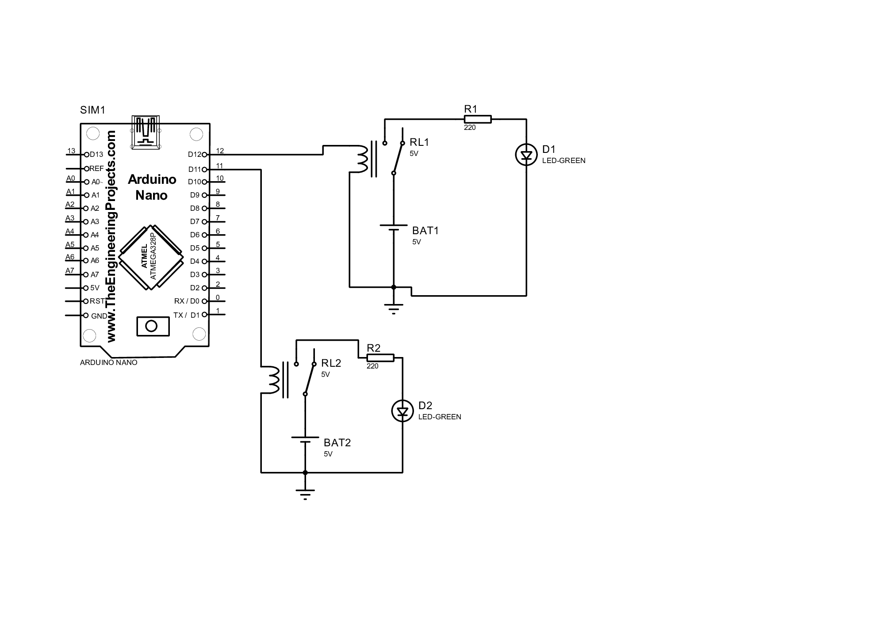
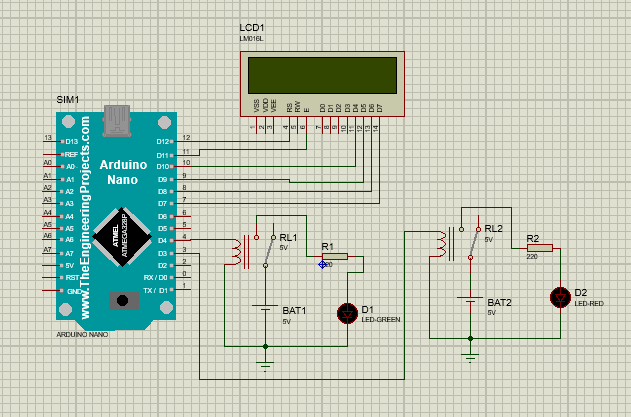
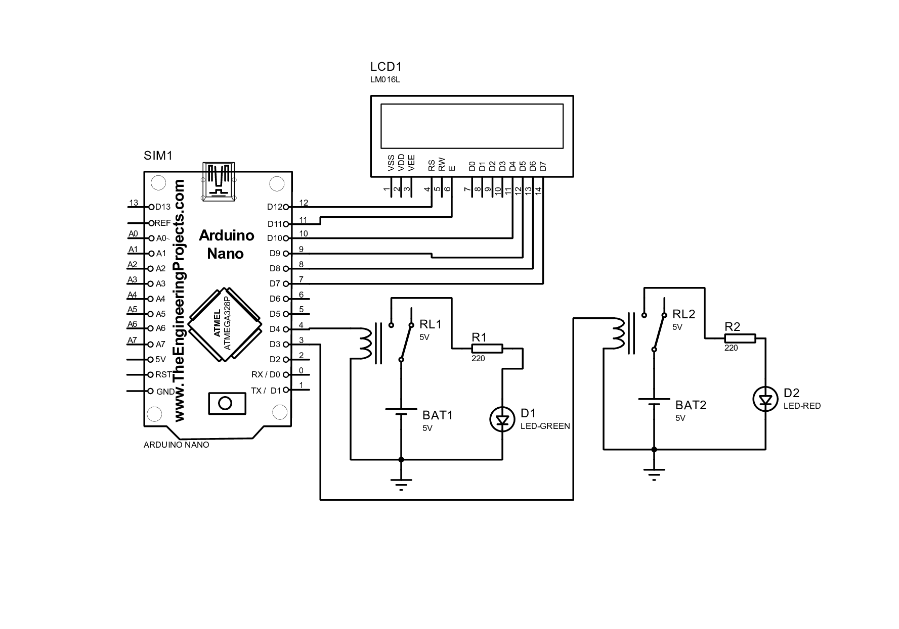

<h1>Introdução ao RTOS.<h1>

Nesse projeto, foi elaborado um circuito em um programa de simulação, um Sistema operacional de
tempo real.

RTOS, do inglês "Real Time Operating System" é um sistema operacional destinado a execução de tarefas em
tempo real, sendo que essas tarefas precisam ser concluidas dentro do prazo pré-definido.

------------------------------------------------------

------------------------------------------------------

<h1>Multitarefas com FreeRTOS.<h1>

Multitarefas no FreeRTOS significa que o sistema operacional tem a capacidade de trabalhar com diversas tarefas
ao mesmo tempo. Essas tarefas são pequenos programas que possuem funções exclusivas. O RTOS tem duas formas de
executas essas tarefas, seja elas na forma intercalada, ou na forma simultanea, se uma tarefa está sendo executada, porem outra tarefa tem mais prioridade, o sistema operacional salva as alterações e executa a tarefa de maior prioridade, compartilhando os recursos de forma eficaz.

------------------------------------------------------

------------------------------------------------------

<h1>Sincronização de Tarefas no RTOS.<h1>

Quando diversas tarefas são executadas ao mesmo tempo, no momento em que essas tarefas utilizam memória, variaveis dividas, será preciso que suas operações sejam sincronizadas para que nao haja erros. A sincronização de tarefas faz o uso de metodos como semáfaros e filas, para que seja garantida a entrada de dados de forma constante.

------------------------------------------------------

------------------------------------------------------

<h1>Reações em Tempo Real.<h1>

Utilizando a variável "temp", será mostrado no LCD o valor calculado da temperatura, se o valor for igual a 
26.00, o LED-GREEN acenderá. Todo esse processo ocorre de forma simultanea.

------------------------------------------------------

------------------------------------------------------

<h1>Vantagens do RTOS.<h1>

1) Multitarefa -  O RTOS possibilita a execução de varias tarefas ao mesmo tempo, dividindo com o sistema os dados de forma eficaz.

2) Sicronização - O RTOS fornece metodos de sincronização entre tarefas de baixa e alta prioridade facilitando o compartilhamento de dados e informações.

3) Confiabilidade - O RTOS é criado para ser um sistema operacional confiavel e robusto, que permite a detecção e restauração de erros.

4) Abstração de tempo - o kernel é responsável por executar as tarefas no devido tempo, sem que a aplicação se preocupe com isso.

5) Manutenabilidade, escalabilidade e modularização - cada uma das tarefas criadas pela aplicação é executada isoladamente e, dessa forma, tem a responsabilidade de gerenciar os recursos do seu respectivo módulo.

6) Planejamento de tarefas de uma equipe - uma vez que os módulos do projeto são muito bem definidos, há a necessidade de se estabelecer a interface entre eles. Uma vez que essas atividades são definidas no projeto, ele pode ser alocado entre diferentes membros da equipe e ser desenvolvido em paralelo.

7) Facilidade em realização de testes - os testes de um módulo são mais fáceis de serem executados dado que a sua interface esteja muito bem definida.

------------------------------------------------------

------------------------------------------------------
<h1>Código do Circuito feito em sala<h1>

``Javascript
#include <Arduino.h>
#include <arduino_FreeRTOS.h>

#define LED_PIN_1 11
#define LED_PIN_2 12

//Protótipos de Tarefas.

void TaskBlink1(void *pvParameters);
void TaskBlink2(void *pvParameters);

void setup () {

//Inicializar os pinos dos LEDs como saídas.

pinMode(LED_PIN_1, OUTPUT);
pinMode(LED_PIN_2, OUTPUT);

//Cria as tarefas

xTaskCreate(
  TaskBlink1, //Função da Tarefa - Ponteiro.
  "Blink1",
  128, //Tamanho de pilha.
  NULL, //Parâmetro da Tarefa.
  2, //Prioridade - números mais altos - proporcional ao Número.
  NULL ); //Agendar tarefa.

xTaskCreate(
  TaskBlink2, //Função da Tarefa - Ponteiro.
  "Blink2",
  128, //Tamanho de pilha.
  NULL, //Parâmetro da Tarefa.
  1, //Prioridade - números mais altos - proporcional ao Número.
  NULL ); //Agendar tarefa.

}

void loop () {

//Nada Aqui

}

void TaskBlink1(void *pvParameters) {
  (void) pvParameters;
  for (;;) { //Loop Infinito
    digitalWrite(LED_PIN_1, HIGH);
    vTaskDelay(1000 / portTICK_PERIOD_MS); // Função millis RTOS
    digitalWrite(LED_PIN_1, LOW);
    vTaskDelay(1000 / portTICK_PERIOD_MS);
  }

}
void TaskBlink2(void *pvParameters) {
  (void) pvParameters;
  for (;;) { //Loop Infinito
    digitalWrite(LED_PIN_2, HIGH);
    vTaskDelay(500 / portTICK_PERIOD_MS); // Função millis RTOS
    digitalWrite(LED_PIN_2, LOW);
    vTaskDelay(500 / portTICK_PERIOD_MS);
  }

}
``

------------------------------------------------------

------------------------------------------------------

<h1>Desafio<h1>

``Javascript
#include <Arduino.h>
#include <Arduino_FreeRTOS.h>
#include <LiquidCrystal.h>

#define LED_1 6 // Led Vermelho
#define LED_2 5 // Led Verde

LiquidCrystal lcd(12, 11, 10, 9, 8, 7);

// //Protótipos de Tarefas.

void TaskReadTemp(void *pvParameters);
void TaskLed1(void *pvParameters);
void TaskLedTemp(void *pvParameters);

// Variável para o valor da temperatura.

volatile float temp = 0.0;

void setup()
{
    Serial.begin(9600);
    lcd.begin(16, 2);

    pinMode(LED_1, OUTPUT);
    pinMode(LED_2, OUTPUT);

    // Cria as Tarefas.

    xTaskCreate(
      TaskReadTemp, //Função da Tarefa - Ponteiro.
      "ReadTemp",
      128, //Tamanho de pilha.
      NULL, //Parâmetro da Tarefa.
      3, //Prioridade - números mais altos - proporcional ao Número.
      NULL); //Agendar tarefa.
 
    xTaskCreate(
      TaskLed1, //Função da Tarefa - Ponteiro.
      "Led1",
      128, //Tamanho de pilha.
      NULL, //Parâmetro da Tarefa.
      3, //Prioridade - números mais altos - proporcional ao Número.
      NULL); //Agendar tarefa.

    xTaskCreate(
      TaskLedTemp, //Função da Tarefa - Ponteiro.
      "LedTemp",
      128, //Tamanho de pilha.
      NULL, //Parâmetro da Tarefa.
      3, //Prioridade - números mais altos - proporcional ao Número.
      NULL); //Agendar tarefa.
}

void loop()
{
    // Nada aqui
}

void TaskReadTemp(void *pvParameters)
{

    (void)pvParameters;
    float sensorValue = 0.0;
    for (;;)
    {
        
        sensorValue = -10.0 + (rand() % 51); // Gera um número aleatório entre -10 e 40.
        temp = sensorValue;
        vTaskDelay(2000 / portTICK_PERIOD_MS); // Aguarda por 2 segundos.
        lcd.setCursor(0, 0);
        lcd.print("Temp: ");
        lcd.print(temp);
        lcd.print(" C");
    }
}

void TaskLed1(void *pvParameters)
{

    (void)pvParameters;
    for (;;)
    {
        digitalWrite(LED_1, HIGH);
        vTaskDelay(500 / portTICK_PERIOD_MS);
        digitalWrite(LED_1, LOW);
        vTaskDelay(500 / portTICK_PERIOD_MS);
    }
}

void TaskLedTemp(void *pvParameters)
{
    (void)pvParameters;
    for (;;)
    {
        if (temp == 26.00)
        {
            vTaskDelay(2000 / portTICK_PERIOD_MS);
            digitalWrite(LED_2, HIGH);
        }
    }
}
``

------------------------------------------------------

------------------------------------------------------

<h1>Schematic Capture.<h1>

Esquemático do circuito de RTOS - Sistema operacional de tempo real feito em sala.

------------------------------------------------------

------------------------------------------------------

<h1>Schematic Capture PDF.<h1>

------------------------------------------------------

------------------------------------------------------

<h1>Schematic Capture.<h1>

Desafio.

------------------------------------------------------

------------------------------------------------------

<h1>Schematic Capture PDF.<h1>

------------------------------------------------------

------------------------------------------------------

Para este projeto foi utiilizado o programa Proteus 8 Professional, bastante utilizado para montar circuitos, onde temos a visão do Esquemático, do Pcb Layout e a Visão 3D.

------------------------------------------------------

------------------------------------------------------

<h1>Proteus 8 Professional.<h1>

------------------------------------------------------

------------------------------------------------------

Thank you so much for reading, have a nice day! :D

------------------------------------------------------