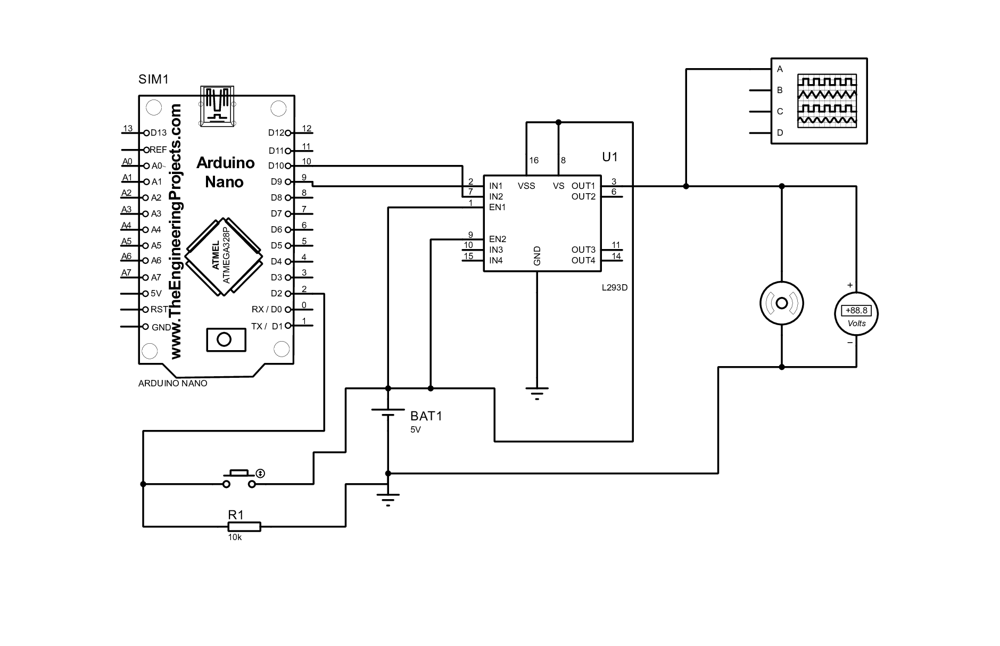

Nesse projeto, foi elaborado um circuito em um programa de simulação, um modulador por largura de pulso.

Veja a seguir, imagens do circuito.

------------------------------------------------------

<h1>Schematic Capture.<h1>

<p>Esquematico do circuito de modulação de largura de pulsos, feito no proteus.<p>

<div align=center>

</div>

------------------------------------------------------


------------------------------------------------------

<h1>Schematic Capture PDF.<h1>

<div align=center>

</div>

------------------------------------------------------


------------------------------------------------------

<h1>Código Fonte.<h1>

```javascript
void setup() {
  pinMode(PWM, OUTPUT);
  pinMode(BUTTON_PIN, INPUT_PULLUP);
}

void loop() {

  int leitura = digitalRead(BUTTON_PIN);

  if (leitura != ultimo_estado_botao) {
    ultimo_estado_botao = leitura;
    if (leitura == HIGH) {  
      tempo_acionado = millis();
    }
  }

  if (leitura == HIGH && ((millis() - tempo_acionado) > tempo_delay)) {
    pwm = pwm + 64;

    if(pwm > 256 ) {
        pwm = 0;
    }
  }

  analogWrite(PWM, pwm);
}
```
------------------------------------------------------


------------------------------------------------------

<p>Para este projeto foi utiilizado o programa proteus, bastante utilizado para montar circuitos, onde temos a visão do Esquematico, do Pcb Layout e a Visão 3D.<p>

------------------------------------------------------


------------------------------------------------------

<h1>Proteus.<h1>

<div align=center>

</div>

------------------------------------------------------


------------------------------------------------------

<h1>Componentes do Esquematico.<h1>

<p>Arduino Nano.<p>
<p>Resistor.<p>
<p>Motor.<p>
<p>Cell.<p>
<p>L293D.<p>
<p>Button.<p>
<p>2 Grounds.<p>
<p>Oscilloscope.<p>
<p>DC Voltometer.<p>

------------------------------------------------------


------------------------------------------------------

<h1>Funcionamento de um PWM.<h1>

<p>O PWM funciona modulando o ciclo ativo (duty cicle) de uma onda quadrada. O conceito de funcionamento é simples. O controlador (fonte de tensão com PWM) entrega uma série de pulsos, gerados em intervalos de igual duração, que pode ser variada. Quanto mais largo o pulso, maior a quantidade de corrente fornecida à carga.<p>

------------------------------------------------------


------------------------------------------------------

<h1>Funcionamento do Projeto.<h1>

<p>No momento em que for pressionado o botão, a velocidade do motor chega em 64. Se clicado mais uma vez, aumentará a velocidade para 127. Se for clicado mais duas vezes, sua velocidade chegará à 191 e 255, respectivamente, assim mantendo sua velocidade constante, ate que o botão seja novamente pressionado, reiniciando sua velocidade.<p>

------------------------------------------------------


------------------------------------------------------

Thank you so much for reading, have a nice day! :D

------------------------------------------------------