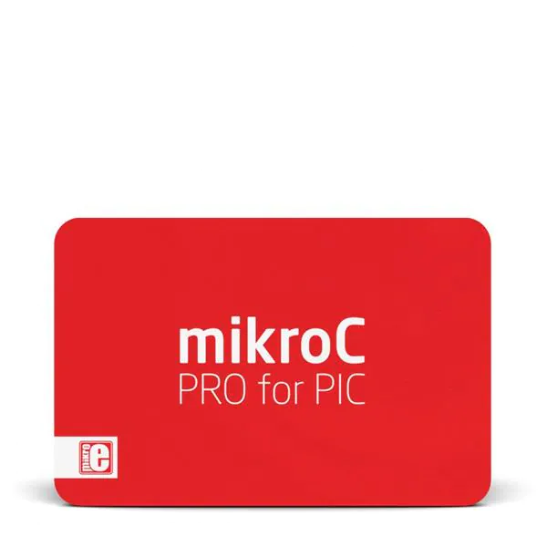

Códigos na linguagem C, para o programa MicroC PRO for PIC, para utilizar no programa Proteus 8 Professional.

------------------------------------------------------

<h1>MicroC PRO for PIC.<h1>

Programa utilizado para o código, e tambem o arquivo hex, necessario para utilizar no Proteus 8 Professional.

------------------------------------------------------

------------------------------------------------------

<h1>Proteus 8 Professional.<h1>

Programa utilizado para o esquemático do circuito, onde usamos o arquivo hex, para testar o projeto

------------------------------------------------------

------------------------------------------------------

Thank you so much for reading, have a nice day! :D

------------------------------------------------------