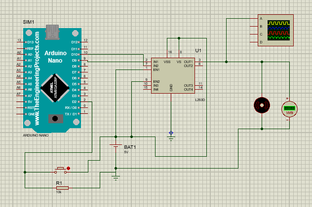

Nesse projeto, foi elaborado um circuito em um programa de simulação, um modulador por largura de pulso

Veja a seguir, imagens do circuito.

------------------------------------------------------

<h1>Schematic Capture<h1>

<p>Esquematico do circuito de modulação de largura de pulsos, feito no proteus<p>

<div align=center>

</div>

------------------------------------------------------

------------------------------------------------------

<h1>Código Fonte<h1>

```javascript
void setup() {
  pinMode(PWM, OUTPUT);
  pinMode(BUTTON_PIN, INPUT_PULLUP);
}

void loop() {

  int leitura = digitalRead(BUTTON_PIN);

  if (leitura != ultimo_estado_botao) {
    ultimo_estado_botao = leitura;
    if (leitura == HIGH) {  
      tempo_acionado = millis();
    }
  }

  if (leitura == HIGH && ((millis() - tempo_acionado) > tempo_delay)) {
    pwm = pwm + 64;

    if(pwm > 256 ) {
        pwm = 0;
    }
  }

  analogWrite(PWM, pwm);
}
```
------------------------------------------------------